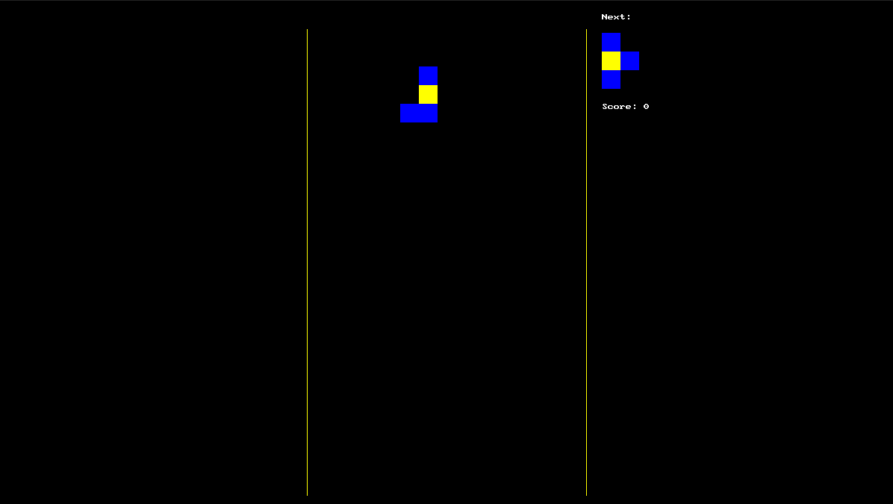
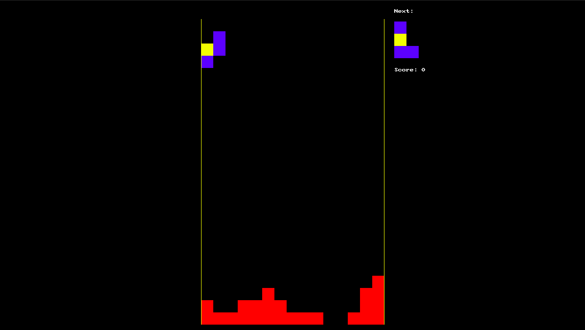
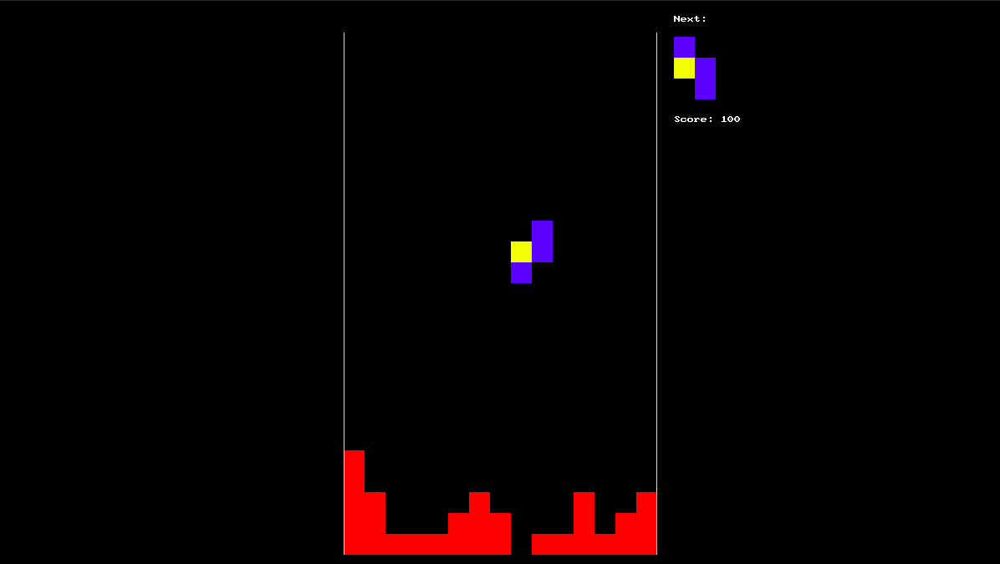
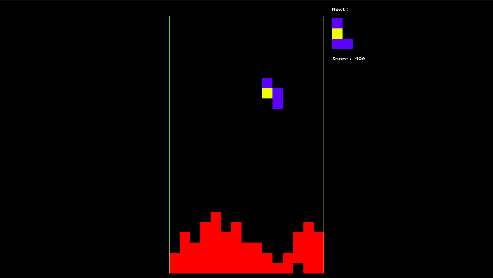
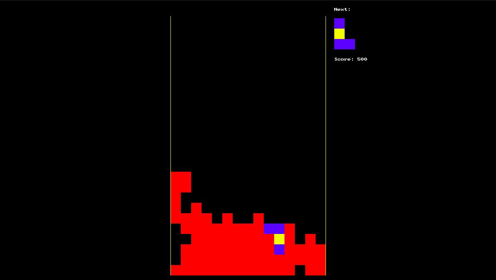
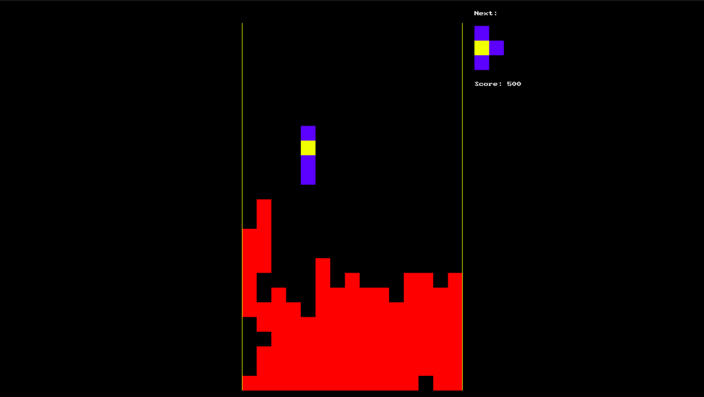
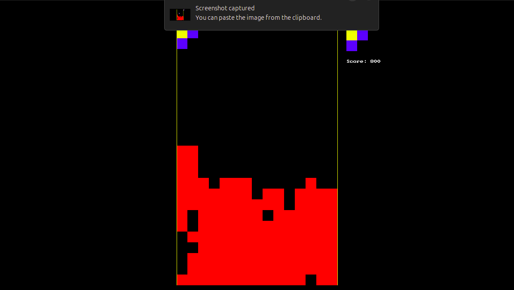
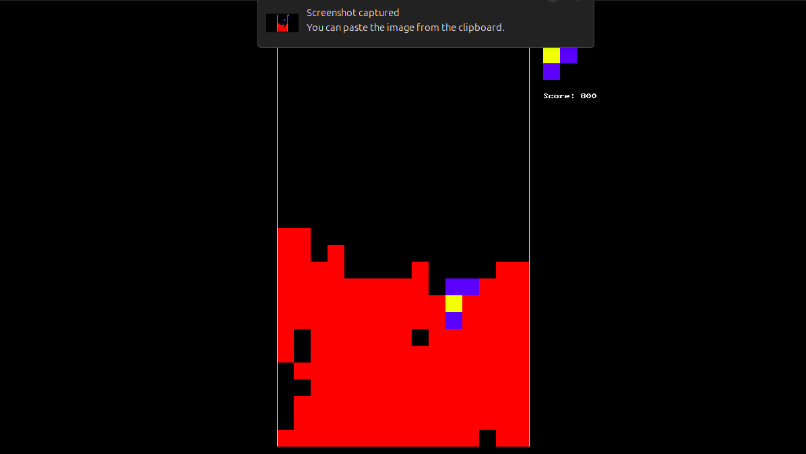
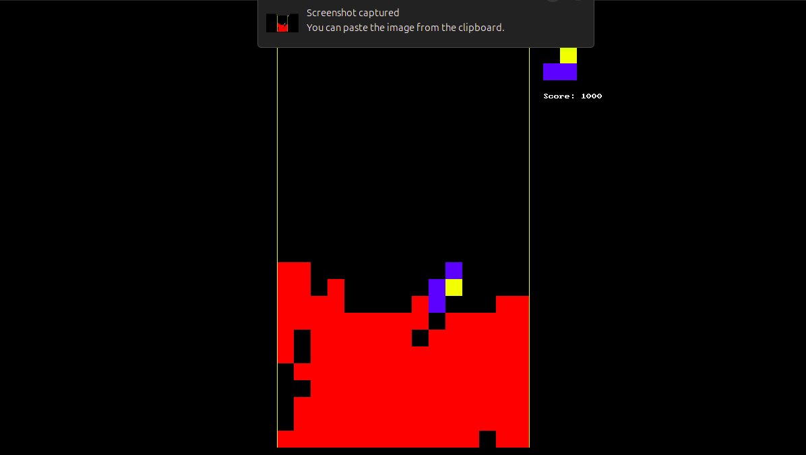
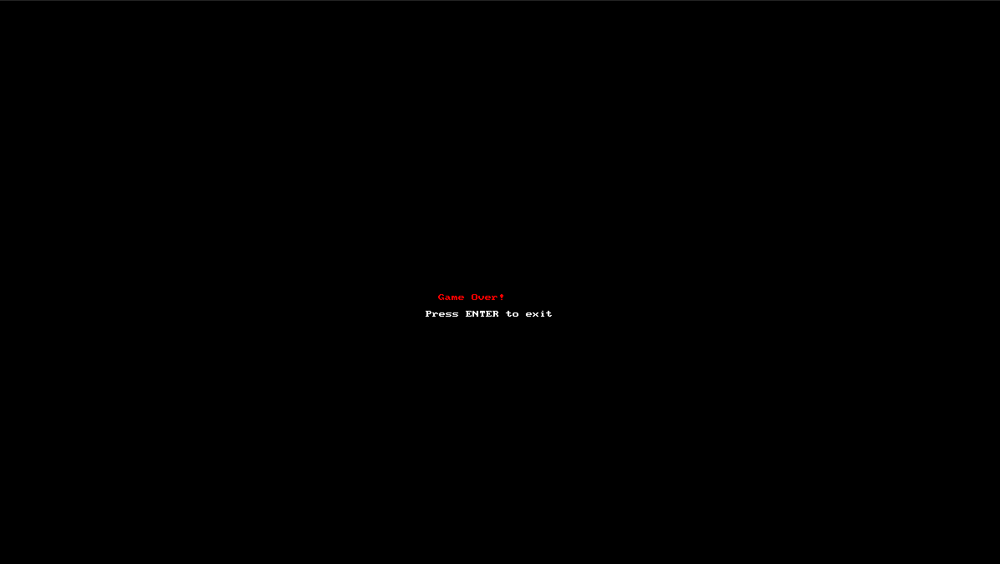

# Tetris in C

A classic retro game implementation in C using the primlib library (SDL wrapper)

## 🎮 Controls

| Key | Action |
|-----|--------|
| `←` | Move piece left |
| `→` | Move piece right |
| `↓` | Move piece down |
| `Space` | Rotate piece |
| `Esc` | Exit the game |
| `Enter` | Exit the game |

---

## 🎯 Game Features

- Classic Tetris gameplay
- Next piece preview display
- Score tracking
- Game over detection
- Colorful graphics using SDL

---

## 🚀 How to Build and Run

1. Ensure you have SDL development libraries(SDL2.0 and SDL2_gfx) installed (linux required)
    ```
    sudo apt install libsdl2-gfx-dev
    ```
2. Compile the project with:
   ```
   make
   ```
3. Run the executable:
   ```
   ./tetris
   ```

---
## 📸 Gallery

<p align="center">
  
  
</p>
<p align="center">
  
  
</p>
<p align="center">
  
  
</p>
<p align="center">
  
  
</p>
<p align="center">
  
  
</p>

---


